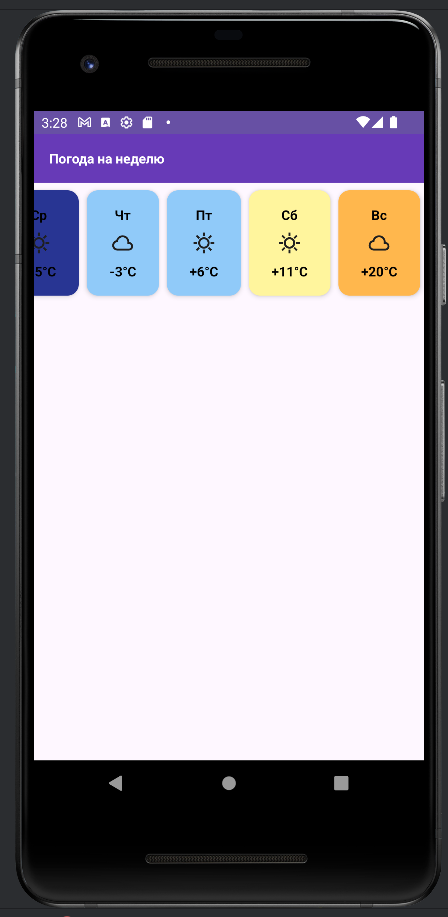
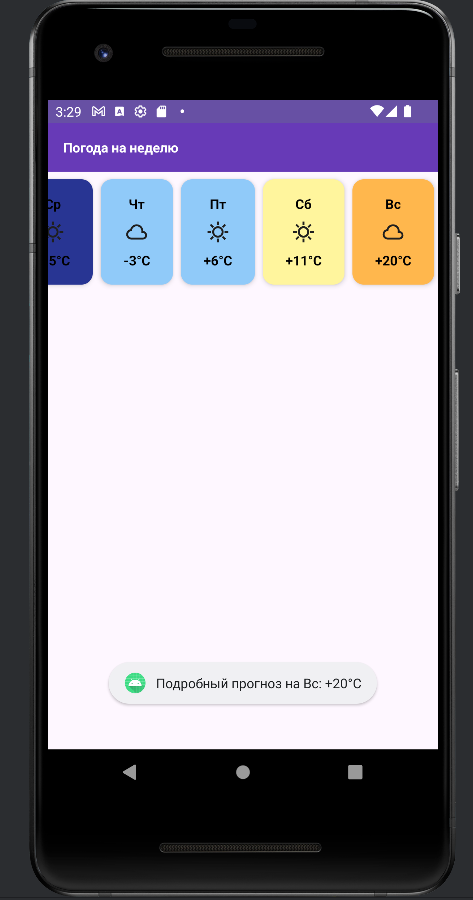

# 🌤 WeatherApp

Учебный Android-проект, созданный для закрепления материала 10-го спринта курса по мобильной разработке. Приложение представляет собой удобный и визуально приятный экран для просмотра прогноза погоды на неделю.

## 📱 Скриншоты
<p align="center">
  
  &nbsp;&nbsp;&nbsp;&nbsp;
  
</p>

## ✨ Особенности и функционал

* **Списочный интерфейс:** Реализовано эффективное отображение списка дней недели с помощью `RecyclerView` и паттерна `ViewHolder`.
* **Динамический UI:** Карточки дней автоматически меняют цвет фона в зависимости от температуры (от глубокого синего для морозов до теплого оранжевого для жарких дней).
* **Умное форматирование:** Реализована логика работы со строками, автоматически добавляющая символ «+» перед положительными значениями температуры.
* **Современный дизайн:** Элементы списка обернуты в `MaterialCardView`, что обеспечивает красивые закругленные углы, тени и визуальное разделение карточек.
* **Интерактивность:** Добавлена обработка кликов (Click Listener) по элементам списка — при нажатии на карточку дня выводится всплывающее сообщение (Toast) с подробностями.

## 🛠 Стек технологий

* **Язык:** Kotlin
* **UI:** Классические XML-макеты (Views)
* **Ключевые компоненты:** `RecyclerView`, `MaterialCardView`, `Adapter`
* **Minimum SDK:** API 29 (Android 10)

## 🚀 Как запустить проект

1. Склонируйте репозиторий:
   ```bash
   git clone [https://github.com/Artem-SPb/WeatherApp.git](https://github.com/Artem-SPb/WeatherApp.git)

2. Откройте проект в Android Studio.

3. Дождитесь окончания синхронизации Gradle.

4. Запустите проект на эмуляторе или реальном устройстве.


## Автор
Шенин Артем Валерьевич

* GitHub: @Artem-SPb


